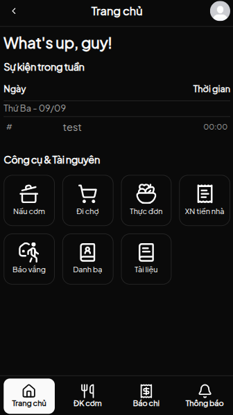
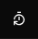
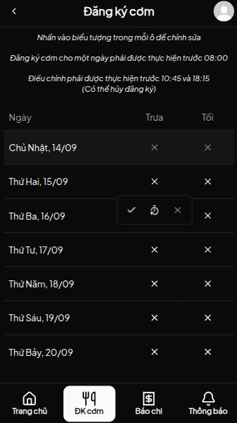
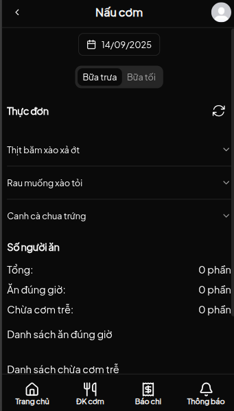
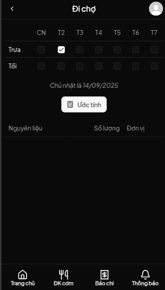
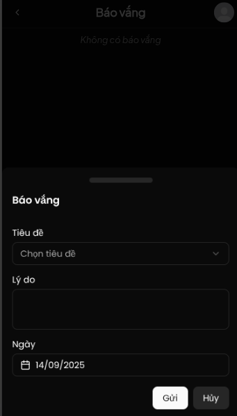
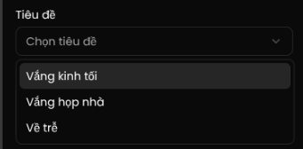
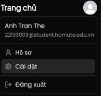
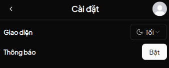

# TD3 UNITEE

## 📑 Mục lục

- [🌐 Trang chủ](#-trang-chủ)
- [🍚 Trang đăng ký cơm](#-trang-đăng-ký-cơm)
- [👩‍🍳 Trang nấu cơm](#-trang-nấu-cơm)
- [🛒 Trang đi chợ](#-trang-đi-chợ)
- [📋 Trang báo vắng](#-trang-báo-vắng)
- [🔔 Bật thông báo](#-bật-thông-báo)
- [🌍 Link Webapp](#-link-webapp)

## 🌐 Trang chủ

- Hiển thị công cụ chính và các sự kiện trong tuần.

## 🍚 Trang đăng ký cơm

- **Ăn đúng giờ** → chọn:  
  

- **Ăn trễ** → chọn:  
  

- **Danh sách đăng ký cơm**:  
  

## 👩‍🍳 Trang nấu cơm

- Bao gồm **danh sách món ăn** và **số người ăn**.

## 🛒 Trang đi chợ

- Hệ thống tự động tính toán **số lượng cần mua** để đi chợ.

## 📋 Trang báo vắng

- Dùng cho những trường hợp đặc biệt (ví dụ: vắng kinh, về trễ...).

  

## 🔔 Bật thông báo

1. Vào phần **Cài đặt**.  
   

2. Cho phép **Thông báo**.  
   

## 🌍 Link Webapp

👉 Truy cập tại: [https://td3unitee.io.vn](https://td3unitee.io.vn)
